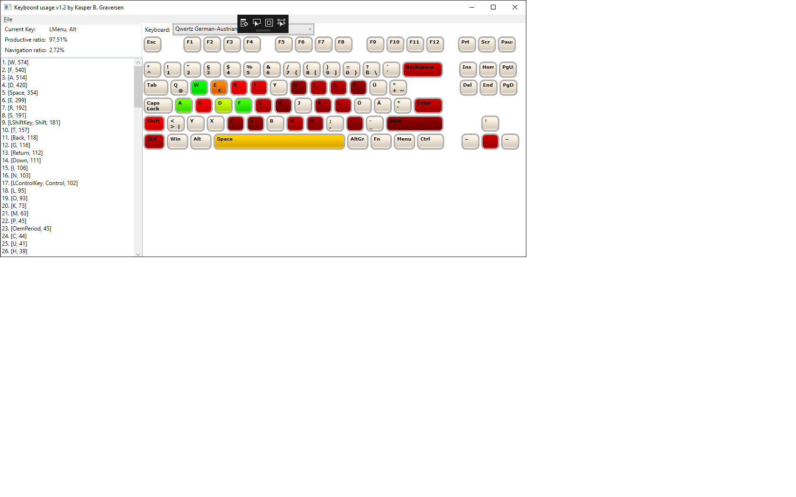

# KeyboordUsage
A keyboard statistics logger that respects your privacy and is configurable to any keyboard in any language.

Top features

  * No communication with external servers - your typing is saved only on your computer
  * Configurable keyboard layout (just edit a json-file)
  * Tracking meta-keys such as ALT, ALTgr, Control, Windows, Menu, ...
  * Currently supported keyboards: QWERTY, DVORAK, (more to come)

  
## How to define a keyboard layout
The application is very open to new keyboard key configurations (e.g. numeric keypad, AZERTY, COLEMAK, ...). All you need to do is to go to the folder with the `KeyboordUsage.exe` from here dig into the folder `Configuration/Keyboard` (browse the .json at https://github.com/kbilsted/KeyboordUsage/tree/master/code/Configuration/Keyboard). Make a copy of any of the `.json` files and start editing. After editing simply restart the application and your new configuration has been picked up. 

If you make something great please share by making a pull request or opening an issue.

## About me
I blog at http://http://firstclassthoughts.co.uk/ and have a ton of open source repositories at http://github.com/kbilsted/

