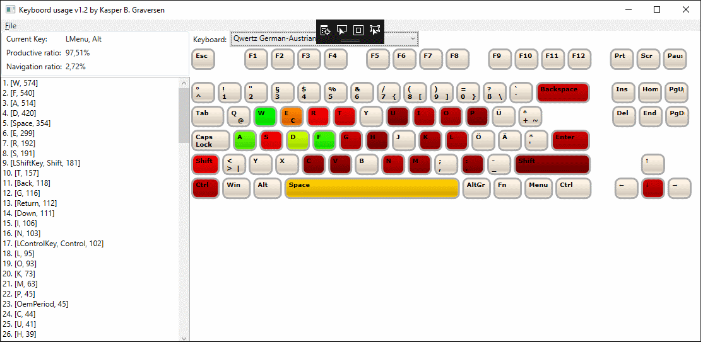

# KeyboordUsage
A keyboard statistics logger that respects your privacy and is configurable to any keyboard in any language.

Top features

  * No communication with external servers - your typing is saved only on your computer
  * Configurable keyboard layout (just edit a json-file to customize language, placement of keys etc)
    * Support for any language, not just US keyboards (configuration for US/GB, Italian and Danish is shipped with the release)
    * Support for any keyboard layout (configuration for QWERTY, DVORAK, TenKeyless is shipped with the release)
  * Showing the ratio between producing text and deleting text (*productive ratio*)
  * Showing the ratio between editing and navigating text (*navigation ratio*)
  * Tracking meta-keys such as ALT, ALTgr, Control, Windows, and Menu

## 1. Installation
Just [download](https://github.com/kbilsted/KeyboordUsage/releases) and extract the zip file and run `KeyboordUsage.exe`

You can also make the program start whenever windows starts. See eg http://tunecomp.net/add-app-to-startup/

## 2. Motivation
My motivation for creating this program was that I wanted to remap certain keys of my keyboard, but I was unsure what keys I am using the most or what "functionality" - ie. am I naviagting more than I'm typing? Am I excessively using the del/backspace? and so forth. Before remapping any keys I wanted that sorted out. 

## 3. How to define/tweak a keyboard layout
The application is very open to new keyboard key configurations (e.g. numeric keypad, AZERTY, COLEMAK, ...). Also for non-programmers!

All you need to do is to go to the folder with the `KeyboordUsage.exe` from here dig into the folder `Configuration/Keyboard` (browse the .json at https://github.com/kbilsted/KeyboordUsage/tree/master/code/Configuration/Keyboard). Make a copy of any of the `.json` files and start editing. After editing simply restart the application and your new configuration has been picked up. 

**If you make something great please share by making a pull request or opening an issue.**

## 4. Contribute!
You are more than welcome to contribute. Just open an issue and we'll discuss your ideas from there. There are plenty of fun features yet to implement ;-)

## 5. About me
I blog at http://http://firstclassthoughts.co.uk/ and have a ton of open source repositories at http://github.com/kbilsted/

